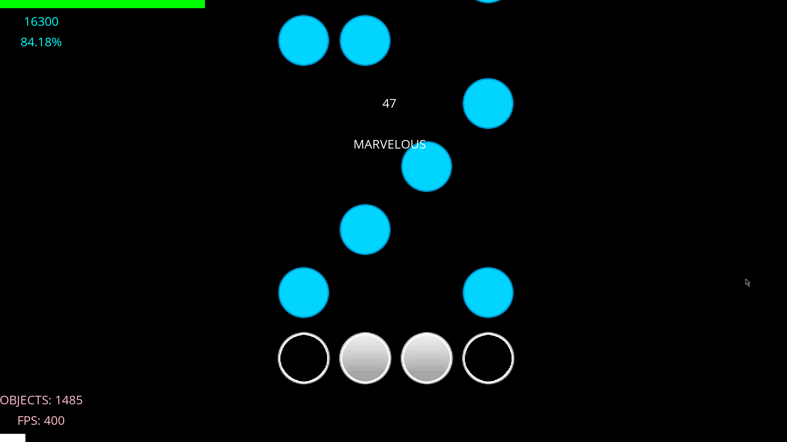

 

  

  <h3 align="center">Astral</h3>

  

    The #1 Python VSRG
     
     
      <a href="https://github.com/RenderingByte/Astral/issues">Report Bug</a>
      |
      <a href="https://discord.gg/fQZS7zFaD3">Discord</a>
      |
      <a href="https://github.com/RenderingByte/Astral/issues">Request Feature</a>
  

## About The Project

Astral is currently the best VSRG that's been written in Python. On top of this, Astral is also open sourced here on GitHub.

Astral is in its early-development stage at the moment, so bugs and missing/broken features should be expected. Knowing this, anyone is welcome to help with development.

*P.S: This project is made in my free time so development may be inactive or slow at times.*

## Getting Started

Astral can be downloaded by clicking <a href="https://github.com/RenderingByte/Astral/tree/dist">here</a>.
 
Make sure you have the prerequisites installed first!

### Prerequisites

What you need to play Astral:

* Python
* Pygame
* PygameGui
* Node.js
* npm
* (Osu?)

*Other packages will be downloaded and installed automatically*

## Contributing

*Soon*
